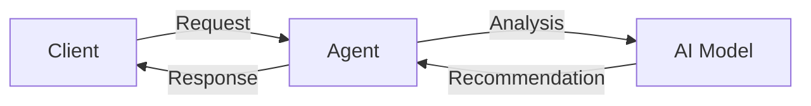

# Glycemic Agent
An open-source, AI-powered diabetes management system using agent-based technology
## Problem Statement
Diabetes management requires continuous monitoring and analysis of glucose levels, medication, and lifestyle.
## Why it Matters
Effective diabetes management can help prevent complications and improve quality of life.
## Architecture

## Project Structure
```
glycemic-agent
|-- README.md
|-- CONTRIBUTING.md
|-- requirements.txt
|-- main.py
|-- src
|    |-- core.py
|    |-- ai_model.py
|    |-- agent.py
|-- config.json
```
## Installation Steps
1. Clone the repository
2. Install dependencies using `pip install -r requirements.txt`
3. Configure the system using `config.json`
## Quick Start
1. Run the system using `python main.py`
2. Interact with the agent using the command-line interface
## Configuration
Configure the system using `config.json`